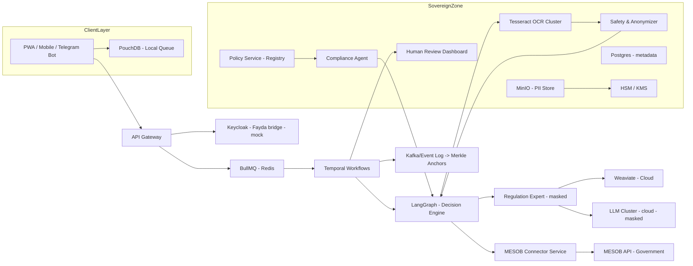
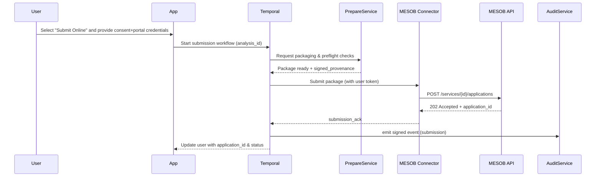

---

# GovAssist Ethiopia (GAE) — Final, Detailed PRD & Technical Specification

**Version:** vFinal-Production (consolidated)  
**Policy Owner / Admin:** You  
**Key constraints locked:** Fayda sandbox not yet available (mock path implemented); cloud LLMs allowed for masked/anonymized calls only; you author & approve Policy Registry YAMLs; you act as initial human reviewer/admin.

This document is the single authoritative PRD + spec for engineering, legal review, procurement, and pilot partners. It assumes the architecture and safety decisions we discussed (Policy Research Agent vs Compliance Agent separation, sovereign-first PII handling, LangGraph + Temporal orchestration pattern, Procedural Playbooks, MESOB integration).

---

# Table of contents

1. Executive summary
    
2. Goals, KPIs & success criteria
    
3. Target users & personas
    
4. Scope (in/out)
    
5. Product features (detailed)
    
6. User journeys (detailed flows)
    
7. System architecture (components + mermaid diagrams)
    
8. Agents & responsibilities (detailed)
    
9. Orchestration & state management (LangGraph / Temporal / BullMQ)
    
10. Policy lifecycle & governance (Policy Registry)
    
11. MESOB one-stop service integration spec (connector + workflows)
    
12. API surface (OpenAPI summary + example payloads)
    
13. Data model (DDL snippets & provenance)
    
14. Tech stacks (exact, per layer)
    
15. UI/UX specification (screens, wireframe notes, copy tone)
    
16. Security, privacy & PDPP compliance (controls + operations)
    
17. ML / OCR pipeline & MLOps (datasets, retrain, metrics)
    
18. Observability, testing & QA plan
    
19. Deployment & infra (hybrid topology + CI/CD)
    
20. Roadmap & backlog (phases, epics, tickets)
    
21. Team, roles & rough cost drivers
    
22. Risk register & mitigations
    
23. Repository Structure (Authoritative)
    
24. .Mandatory Reference Documentation (For Coding Agents)
	 
25. Conclusion & Final Assertions  
    
26. Deliverables I will produce next (pickable artifacts)
    

---

## 1 — Executive summary (one paragraph)

GovAssist Ethiopia (GAE) is a sovereign-first, audit-first multi-agent platform that helps Ethiopian citizens and SMEs prepare, validate, and complete government document processes. GAE combines deterministic policy enforcement, verified procedural playbooks, Amharic-optimized document intelligence, and an optional submission/execution connector to national one-stop systems like MESOB. LLMs assist with research and summarization but cannot change enforcement rules — only humans can. The system is offline-capable, PDPP-compliant by design, and built to produce auditable, signed artifacts.

---

## 2 — Goals, KPIs & success criteria

**Primary goals**

- Reduce rejections and repeated bureau visits for target flows.
    
- Make step-by-step procedural guidance authoritative, traceable, and usable offline.
    
- Provide a secure path to submit to digital government portals (MESOB) where available.
    

**Success KPIs (12 months)**

- First-pass acceptance for MVP flows ≥ 85% (pilot target).
    
- Offline sync success ≥ 99.9%.
    
- PII redaction accuracy ≥ 99% (known patterns).
    
- Human-review SLA for critical escalations ≤ 24 hours (pilot).
    
- Adoption: 5,000 verified SMEs and 20,000 individuals in 12 months (pilot→scale target).
    

Operational KPIs:

- Availability 99.5% (system-wide), P95 latency < 5s for read ops.
    
- LLM cost per user/session within budget caps (cost-control agent enforced).
    

---

## 3 — Target users & personas

1. **SME — Sole Proprietor (Addis Ababa)** — low digital literacy; needs trade license/business registration.
    
2. **SME — VAT-registered** — needs renewals, compliance checks.
    
3. **Individual** — passport/ID application guidance.
    
4. **Admin / Policy Owner (You)** — author & approve policies; review escalations.
    
5. **Reviewer** — licensed accountant/legal reviewer for escalations.
    

Design the interface priorities for low-literacy, mobile-first, Amharic-first language support.

---

## 4 — Scope

**In-scope (MVP+):**

- Procedural Playbooks (ordered step-by-step playbooks per flow + branch variants).
    
- Document ingestion & Amharic-focused OCR (Tesseract ensemble + cloud fallback).
    
- Deterministic Compliance Agent reading Policy Registry.
    
- Policy Research Agent (LLM-assisted drafts only) + Review Queue.
    
- Human Review dashboard & signing (HSM).
    
- Offline-capable PWA + Telegram bot; local queue (PouchDB) sync to CouchDB.
    
- MESOB connector for digital submission (configurable, consent-first).
    
- Audit/logging (Kafka), artifact signing (HSM), PDPP mapping.
    

**Out-of-scope (MVP):**

- Automatic submission to government portals without explicit opt-in/consent.
    
- Acting as legal authority or replacing government approvals.
    
- Large-scale multi-lingual expansions beyond Amharic + English at launch.
    

---

## 5 — Product features (detailed)

### 5.1 Procedural Playbooks (core)

- Canonical, versioned playbooks per flow & branch (sub-city).
    
- Each playbook step: title, office, required documents, fees, duration, common failures, next steps, conflict notes.
    
- Admin UI for authoring, preview, CI tests (test_cases), diff & approval.
    
- Playbooks used to drive wizard UI and automated MESOB submission mapping.
    

### 5.2 Document Readiness & Prefill

- Document Analyzer: layout-aware OCR, table extraction, stamp detection, signature detection.
    
- Per-field confidence vector.
    
- Readiness score & “what to fix” list before user leaves or submits.
    
- Prefill official forms with provenance per field; user edits & signs.
    

### 5.3 Compliance Agent (deterministic)

- Reads Policy Registry only.
    
- Produces pass/fail/conditional with evidence and remediation steps and citations.
    
- Enforces hierarchy (proclamation > regulation > directive > guideline).
    

### 5.4 Policy Research Agent (LLM-assisted)

- Researcher-only role: fetches references, drafts YAML, bundles sources, includes confidence scores.
    
- Drafts are queued for admin review — cannot auto-publish.
    

### 5.5 MESOB Integration (connector)

- Connector service mapping playbooks → MESOB API schemas, handles authentication, submission, webhook status updates, rejections, downloads.
    

### 5.6 Human Review & Admin Dashboard

- View uncertain cases, sign artifacts, correct OCR, approve/dismiss policy drafts, escalate to legal experts.
    

### 5.7 Audit & Non-repudiation

- All agent actions emitted as signed events; final artifacts carry provenance + HSM signature + daily Merkle anchoring.
    

### 5.8 Offline-first UX

- PouchDB local queue with queues for document uploads and actions; user can prepare playbook steps offline; auto sync when online.
    

### 5.9 Cost Control Agent

- Tiered model selection: local small models → local medium → cloud large LLMs; budget gating per session; caching of RAG results.
    

---

## 6 — User journeys (examples)

### Journey A — Renewal of Trade License (user flow)

1. User picks “Renew trade license” → wizard collects jurisdiction & business type.
    
2. System selects playbook (Addis → Bole) and displays timeline.
    
3. User uploads existing trade license + TIN + lease agreement.
    
4. Document Analyzer runs locally; shows readiness score 78% and missing stamp on page 2.
    
5. User fixes and reuploads → readiness 98%.
    
6. User opts “Submit online” → system checks MESOB availability, requests portal credentials (explicit consent).
    
7. GovAssist maps data → submits via MESOB connector → returns `app_id`.
    
8. User tracks status in GovAssist; once approved, artifact is signed and available.
    

### Journey B — Passport application (document-first)

1. User uploads scanned birth certificate & ID photo.
    
2. OCR extracts fields; compliance agent checks playbook (passport flow).
    
3. System flags photo rejection advice; recommends photo guidelines and reshoot instructions with templates.
    
4. User reuploads photo; system pre-fills the form; user downloads printable PDF and books appointment through the app (if physical required).
    

---

## 7 — System architecture (components + diagrams)

### 7.1 Logical component diagram (mermaid)




### 7.2 MESOB integration flow (mermaid)




---

## 8 — Agents & responsibilities (detailed)

### 8.1 Policy Research Agent (PRA)

- Inputs: admin query (job), allowlist domains, optional doc.
    
- Actions: crawl allowlist sites, fetch PDFs, extract legal text, build draft policy YAML, attach `source_bundle` (url, doc_id, page, snippet), compute `confidence`.
    
- Output: `draft_policy` (read-only) into ReviewQueue.
    
- Safety: domain allowlist, rate-limiting, no auto-publish.
    

### 8.2 Policy Service / Registry

- Stores approved policies, versions, effective_date, supersedes, test_cases, impact_metadata, conflict_policy.
    
- Exposes read API for Compliance Agent; write API for admin only (CI gated).
    

### 8.3 Compliance Agent

- Deterministic evaluator (Drools/custom). Input: analysis_id + policy_id.
    
- Output: compliance_report with rules_evaluated (id, status, evidence, citation_bundle).
    
- No web access.
    

### 8.4 Regulation Expert (RAG)

- Masked text input.
    
- Performs retrieval (BM25 + vector) and summarization; returns summary + citation_bundle.
    
- Citation Auditor verifies that summary claims are backed.
    

### 8.5 Vision Router & OCR Ensemble

- VisionRouter decides: local Tesseract or fallback Vision LLM based on heuristics (blur, stamps, handwriting, vendor config).
    
- OCR outputs per-field confidences + bounding boxes.
    

### 8.6 Safety & Anonymizer

- PII detection (Amharic-aware), tokenization, pii_map for local rehydration, blocks cloud calls if consent missing.
    

### 8.7 Human Review Agent & Dashboard

- Review queue for uncertain/compliance-critical cases and policy drafts.
    
- Reviewer annotates and signs; HSM-signed decisions append to provenance.
    

### 8.8 MESOB Connector

- Connector per MESOB service: auth, form mapping, file upload, status polling/webhooks, error mapping.
    
- Configurable per service with mapping templates authored by admin.
    

### 8.9 Audit Agent

- Emit append-only events to Kafka; sign important artifacts; daily Merkle root for archival.
    

---

## 9 — Orchestration & state management

**Roles**

- **BullMQ (Redis):** short-lived job ingestion and backpressure.
    
- **LangGraph:** decision routing and agent arbitration (stateless decisions).
    
- **Temporal:** durable workflows, long-running human waits, retries, durable state, deterministic replay.
    

**Design rules**

- Temporal owns workflow state and durability. It calls LangGraph activities to decide which agent to call next and persists results.
    
- LangGraph does not store long-term state; it takes workflow state and returns routing decisions or prompts to Temporal.
    
- BullMQ only signals Temporal to claim work or supports immediate synchronous worker invocation.
    

**Example Temporal workflow steps (pseudocode)**

1. validate_upload
    
2. call_langgraph(VisionRouter)
    
3. branch → call OCRLocal or OCRFallback
    
4. call SafetyAnonymizer
    
5. call LangGraph(RegulationCandidate)
    
6. call RAG (masked)
    
7. call CitationAuditor
    
8. call ComplianceAgent
    
9. if uncertain → human_review_activity (wait / timeout / escalate)
    
10. generate_artifact & sign
    
11. if user opted → call MESOB Connector
    
12. emit_audit_event
    

---

## 10 — Policy lifecycle & governance (Policy Registry)

**Lifecycle**

1. PRA generates `draft_policy` (draft_id).
    
2. Admin reviews via Admin UI: edits, runs `test_cases`.
    
3. CI validates YAML (schema + test cases).
    
4. Admin approves; policy moves to `approved` with `effective_date`.
    
5. Compliance Agent reads new policy; at `effective_date` it becomes active.
    
6. Policy updates create `supersedes` links; rollback supported.
    

**Policy fields**

- id, title, jurisdiction, effective_date, supersedes, impact_metadata, conflict_policy, rules[], test_cases[], review_history[].
    

**CI Tests**

- Each policy must include `test_cases` with sample inputs and expected outputs; CI executes Compliance Agent against tests.
    

**Approval authority**

- Admin (you). Optionally add government approver roles later.
    

---

## 11 — MESOB one-stop service integration spec (connector + workflows)

### 11.1 Purpose

Allow GovAssist to submit pre-validated application packages to MESOB services (or other digital portals) on behalf of users, with explicit consent and credentialed access.

### 11.2 Connector responsibilities

- Auth: support user-supplied credentials (Fayda/OIDC) or service account with explicit user consent.
    
- Mapping: transform GovAssist artifact → portal form schema (templating).
    
- Upload: multipart/form-data or API-specified file upload.
    
- Tracking: poll or register webhooks; normalize statuses → GovAssist UI.
    
- Error handling: map portal error codes → human-readable remediation items.
    
- Security: store tokens encrypted; minimal retention; explicit user consent for storing credentials.
    

### 11.3 Connector API (example endpoints)

- `POST /connectors/mesob/services/{serviceId}/submit`  
    Body: `{application_package, user_token, metadata}`  
    Returns: `{submission_id, status}`
    
- `GET /connectors/mesob/submissions/{submissionId}/status`  
    Returns normalized status and portal raw message.
    
- `POST /connectors/mesob/webhook`  
    Portal invokes this for status updates (signed request; verify signature).
    

### 11.4 Workflow integration

- Temporal step: `submit_to_mesob` calls connector; on `202` proceed to `track_submission`.
    
- If portal returns `error` with `missing_field` → present remediation and re-run submission after fix.
    
- All submission events are audited and signed.
    

### 11.5 Consent & legal

- Before allowing GovAssist to submit with user credentials, require explicit consent (signed DPA and submission consent).
    
- If using service account to submit on user’s behalf, ensure legal agreements with government; store consent artifacts.
    

---

## 12 — API surface (OpenAPI summary + example payloads)

Use the earlier OpenAPI skeleton as canonical. Key endpoints with behavior notes:

### Authentication

- `POST /v1/auth/login` — start Fayda OIDC or phone OTP (mock mode available).
    
- `GET /v1/users/me` — returns profile & consent status.
    

### Document & analysis

- `POST /v1/documents/upload` — multipart upload, returns `document_id`, `job_id`.
    
- `POST /v1/documents/{documentId}/analyze` — start Temporal workflow, return `analysis_id`.
    
- `GET /v1/analysis/{analysisId}` — returns OCR, layout, per-field confidences, `pii_map` (redacted), `compliance_report`, `citation_bundle`, `provenance`.
    

### Policy & research

- `POST /v1/research/policy-draft` — admin-only: start PRA job.
    
- `GET /v1/research/drafts/{draftId}` — get draft and source bundle (admin-only).
    
- `POST /v1/policy/approve` — admin-only: merge draft after CI tests.
    

### Compliance & form

- `POST /v1/compliance/check` — runs compliance against a policy flow.
    
- `POST /v1/forms/{flow}/prefill` — prefill official templates; returns signed `artifact_id` and `download_url`.
    

### MESOB connector

- `POST /v1/mesob/submit` — submit prefilled artifact to MESOB (requires consent & credentials).
    
- `GET /v1/mesob/status/{submissionId}` — status.
    

### Audit & review

- `POST /v1/review/submit` — submit to human reviewer.
    
- `GET /v1/audit/events` — admin/auditor only.
    

**Response invariants**

- All legal claims include `citation_bundle`.
    
- All artifacts include `provenance` and `signature`.
    
- Any cloud LLM call is logged (prompt+masked response) and subject to audit.
    

---

## 13 — Data model (DDL snippets & provenance)

Key DDL already provided earlier; include these tables:

- users, sessions, documents, analyses, policies, audit_events, submissions (MESOB).
    

**Provenance object (schema snippet)**:

```json
{
  "artifact_id":"uuid",
  "created_at":"ISO8601",
  "created_by_agent":"ComplianceAgent-v1",
  "input_doc_ids":["minio://uploads/doc-123.pdf"],
  "operations":[{"op":"ocr","model":"tesseract-v5","confidence":0.92}],
  "citation_bundle":[{"doc_id":"PROCL-1205-2020","page":3,"snippet":"..."}],
  "signature":"base64-hsm-signature"
}
```

---

## 14— Tech stacks (exact, per layer) — included in the PRD above (explicit list)

Below are the exact tech stacks referenced in the PRD, listed clearly per layer so there is no ambiguity. This is an explicit, complete list of recommended technologies and libraries that were named or implied in the PRD and Spec.

> These are the **exact tech stacks** to use for the project. Use these versions/choices unless a procurement/legal requirement mandates otherwise.

### Client / Frontend

- React + Next.js (PWA)
    
- Tailwind CSS (UI utility)
    
- React Query (data fetching/state)
    
- React Hook Form (forms)
    
- i18next (internationalization)
    
- IndexedDB (via Dexie or PouchDB for offline)
    
- PouchDB (client) / CouchDB (server sync)
    

### Mobile / Bot

- React Native (optional mobile)
    
- Node.js + Telegraf (Telegram bot)
    
- WhatsApp Business API (for WhatsApp integration, via provider)
    
- Twilio (optional SMS/WhatsApp routing)
    

### API / Backend

- Node.js (TypeScript) for API gateway & microservices (or Python FastAPI where ML-heavy)
    
- FastAPI (Python) — for ML agents or Python services (optional)
    
- NestJS (TypeScript) (optional alternative)
    
- gRPC for inter-service communication (where low-latency required)
    
- REST (OpenAPI) for external APIs
    

### Orchestration & Queues

- BullMQ (Redis) — short-lived job queues
    
- Redis (as BullMQ backend)
    
- Temporal — durable workflows & long-running orchestration
    
- LangGraph — agent graph & decision orchestration
    

### Agents / Rule Engine

- Drools — rule engine (Java) (optional) OR custom rule engine in Node/Python
    
- LangChain-like patterns (for RAG orchestration) — but custom wrapper recommended
    

### OCR / Layout / ML

- Tesseract v5 (fine-tuned for Amharic) — primary OCR
    
- LayoutLMv3 — layout-aware extraction (HuggingFace)
    
- Donut-style models (document understanding)
    
- Vision LLM (cloud providers or local LLM) as OCR fallback for handwriting (e.g., Llama 2, Mistral variants, or provider-managed models)
    
- HuggingFace Transformers — model infra & experimentation
    
- SentenceTransformers or multilingual embedding models (XLM-R-based) for embeddings
    

### Retrieval / Vector DB

- Weaviate OR Milvus — vector database for semantic retrieval
    
- BM25 via Elasticsearch / OpenSearch for exact legal ref search (hybrid strategy)
    

### Databases / Storage

- PostgreSQL — relational metadata & state
    
- MinIO (S3-compatible) — object storage in sovereign zone
    
- CouchDB — sync server for PouchDB clients (optional)
    
- Kafka (or EventStore) — append-only audit/event log
    

### Model Serving & MLOps

- Ray or KServe for model orchestration/serving
    
- NVIDIA Triton (optional) for high-throughput inference
    
- BentoML or MLflow for model packaging & deployment
    
- Dataset labeling tool (Label Studio or custom) integrated with Human Review UI
    

### Security, Keys & Signing

- HashiCorp Vault — secrets management
    
- HSM (Hardware Security Module) — signing artifacts (AWS CloudHSM / Azure Key Vault HSM or on-prem HSM)
    
- Keycloak — identity provider & OIDC (Fayda OIDC bridge to be added later)
    
- TLS 1.3; mTLS for service-to-service
    

### Observability & DevOps

- Prometheus + Grafana — metrics & dashboards
    
- Loki (or ELK stack) — logs
    
- Jaeger / OpenTelemetry — tracing
    
- Snyk / Trivy — dependency & image scanning
    
- GitHub Actions — CI
    
- ArgoCD — GitOps for k8s deployments
    

### Infrastructure & Orchestration

- Kubernetes (k8s) — cluster management (on-prem + cloud)
    
- Helm charts — deployments
    
- Terraform — infra provisioning
    
- Docker — container images
    

### Vectorization & Search

- FAISS (local) — optional vector search cache
    
- Elasticsearch / OpenSearch — BM25 & keyword search
    

### Payment & Local Integration

- Telebirr integration (or local payment gateway) — for payment flows
    
- Additional local integrations (MESOB connectors, bureau-specific APIs)
    

### Developer Tools (CLI/TUI)

- Python Typer / Click OR Go Cobra for CLI
    
- Textual (Python) or Bubble Tea (Go) for TUI
    
- Temporal CLI for workflow control
    

### Testing & QA

- Pytest / Jest for unit tests
    
- Postman / Newman for API tests
    
- Cypress for E2E browser tests
    
- k6 / JMeter for load testing
    

---

# — Detailed explanation / rationale for each stack selection

(Short explanatory notes for each category — why chosen and how it fits the specification.)

### Frontend (React + Next.js, Tailwind)

- **Why:** PWA-first approach, offline capability, strong ecosystem for i18n, mobile-friendly. Next.js provides server-side rendering for better initial load and SEO (for docs/help pages).
    

### Offline (PouchDB + CouchDB)

- **Why:** Reliable local queue for offline-first UX; PouchDB syncs to CouchDB easily; widely used pattern for intermittent connectivity.
    

### Backend (Node.js TypeScript + FastAPI)

- **Why:** Node.js/TypeScript for rapid microservices and frontend parity; Python FastAPI for ML/AI services where Python ecosystem is dominant (HuggingFace, Tesseract, Label Studio integrations).
    

### Orchestration (Temporal + LangGraph + BullMQ)

- **Why:** Temporal provides durable, auditable workflows (essential for human waits and long-running processes). LangGraph provides decision routing for agents without being the single point of failure. BullMQ acts as a simple intake buffer; all three together separate concerns and provide production reliability.
    

### OCR / ML (Tesseract, LayoutLMv3, Donut)

- **Why:** Tesseract is open-source and tunable for Amharic; layout models handle forms/tables better; Donut-style approaches are strong for document-to-data pipelines. Ensemble reduces failure risk.
    

### Vector DB & Retrieval (Weaviate / Milvus + BM25)

- **Why:** Hybrid retrieval (BM25 + vector) gives reliable legal citation retrieval (BM25 for exact refs, vectors for semantic matches). Weaviate or Milvus are mature vector stores.
    

### Databases (Postgres + MinIO)

- **Why:** Postgres for structured metadata, MinIO provides S3-compatible local object storage for sovereign PII storage.
    

### Key management & signing (Vault + HSM)

- **Why:** HSM ensures non-repudiable artifact signatures and legal defensibility; Vault centralizes secrets.
    

### Observability & DevOps (Prometheus/Grafana/Jaeger)

- **Why:** Production-grade monitoring and tracing necessary for SLA & audits; GitOps (ArgoCD) and CI ensure reproducibility.
    

### Model serving & MLOps (Ray, Triton, BentoML)

- **Why:** Supports scalable model serving and GPU pools; Triton optimizes inference throughput when needed.
    

### Security (Keycloak, TLS, mTLS)

- **Why:** OIDC standard for identity (Fayda bridge later); mTLS for internal trust; PDPP mapping requires solid auth and traceability.
    

---


## 15 — UI/UX specification (detailed)

### 15.1 Principles

- Wizard-first, chat-second
    
- Amharic-first language
    
- Progressive disclosure
    
- Explicit uncertainty & human review states
    
- Offline queue visible to user
    

### 15.2 Key screens / components

1. **Home / Task selector** — task-first tiles (Register business, Renew license, Apply passport).
    
2. **Wizard step screen** — single question per screen, progress bar, "Save & resume".
    
3. **Document upload screen** — camera & file, immediate feedback (blurry, missing page), preview with highlighted extracted fields.
    
4. **Readiness & remediation** — readiness score, list of fixes, "Fix now" or "Save for later".
    
5. **Procedural playbook detail** — interactive checklist, per-step office details, fees, expected duration, common failures.
    
6. **Assisted form fill screen** — prefilled with provenance per field, editable.
    
7. **Submission & tracking screen** — shows MESOB submission id, timeline, and status updates.
    
8. **Human review monitor** — shows reviewer status, ETA, comments.
    
9. **Admin UI** — policy authoring, draft queue, diffs, CI test runner, approve/publish UI.
    
10. **Developer console** — TUI/CLI for developers (separate, admin-only).
    

### 15.3 Copy & tone

- Plain Amharic (avoid legalese)
    
- Use positive/constructive messages for failures
    
- Always show "why" and "what to do next"
    

---

## 16 — Security, privacy & PDPP compliance (controls + operations)

### 16.1 Core privacy controls

- Default local PII storage in sovereign MinIO with TTL (24–72h by default).
    
- Safety Agent must mask/tokenize PII before any cloud LLM call.
    
- Consent: signed DPA stored as `consent_hash`.
    
- DSR endpoints (access/rectify/erase) with admin workflow for deletion of raw PII.
    

### 16.2 Cryptographic & key controls

- HSM for signing artifacts; rotate quarterly.
    
- TLS1.3 end-to-end; mTLS between services.
    
- Vault for secrets.
    

### 16.3 Operational controls

- Audit trails (Kafka); all sensitive events logged encrypted.
    
- Breach playbook with PDPP-compliant notification timing.
    
- Access controls: Keycloak RBAC for user/admin/reviewer roles.
    
- Prompt injection defenses: sanitize OCR, use allowlist domains for PRA.
    

---

## 17 — ML / OCR pipeline & MLOps

### 17.1 OCR stack

- Baseline: Tesseract v5 fine-tuned on Amharic government forms.
    
- Layout: LayoutLMv3 or Donut-style models for complex templated extraction.
    
- Fallback: Vision-Language LLM (cloud) for handwriting/stamp inference when local confidence low.
    

### 17.2 Datasets & labeling

- Golden Set: seed 200 labeled documents; target 2,000 for production.
    
- Labeling tool integrated into Human Review UI to capture corrections.
    
- Active learning queue: low-confidence items auto-sent to labeling.
    

### 17.3 Metrics & retrain cadence

- Track CER/WER per doc type. Retrain monthly (mini-batch) and major retrain quarterly.
    
- Track per-field confidence calibration and reject rate.
    

---

## 18 — Observability, testing & QA plan

### 18.1 Observability

- Metrics: agent latencies, workflow durations, OCR confidence distributions, LLM token counts, MESOB submission success rates.
    
- Logs: structured logs shipped to Loki/Elastic.
    
- Tracing: Jaeger for cross-service tracing.
    

### 18.2 Testing

- Unit tests per agent.
    
- Integration tests: LangGraph + Temporal + OCR + Compliance.
    
- E2E tests (CI) with sample golden workflows (100+ cases).
    
- Policy CI: every policy PR must include `test_cases` that run in CI.
    

### 18.3 Acceptance criteria (sample)

- For a target flow, pilot sample first-pass acceptance ≥ 85%.
    
- All generated legal claims include at least one `citation_bundle` entry.
    
- No cloud LLM calls with unmasked PII.
    

---

## 19 — Deployment & infra (hybrid topology + CI/CD)

### 19.1 Hybrid topology

- **Sovereign zone (Ethiopia):** Keycloak, Postgres, MinIO, Tesseract, Temporal worker for human review, HSM, LangGraph.
    
- **Compute zone (Cloud/private):** Vector DB (Weaviate), heavy LLM inference (masked), backups, analytics.
    
- Secure peering with strict egress logs and DTA.
    

### 19.2 CI/CD & GitOps

- GitHub + GitHub Actions for build + security scans (Snyk/Trivy).
    
- ArgoCD for GitOps on k8s clusters (separate apps per zone).
    
- Policy Registry as separate Git repo with CI validation.
    

---

## 20 — Roadmap & backlog (phased)

**Phase 0 (2–3 weeks):** Architecture lock, Policy Registry repo, Fayda mock, collect 200 seed dataset.  
**Phase 1 (Month 0–2):** Identity & offline sync; BullMQ & Temporal baseline; Postgres + MinIO; Tesseract PoC; Admin UI skeleton.  
**Phase 2 (Month 3–4):** Policy Service + Compliance Agent; Safety/Anonymizer; Vision Router & OCR ensemble.  
**Phase 3 (Month 5–6):** PRA prototype + Draft Queue; RAG masked + Citation Auditor; MESOB connector initial stub.  
**Phase 4 (Month 7–9):** Human Review UI & signing; PWA & Telegram bot; pilot SMEs/3 sub-cities.  
**Phase 5 (Month 10–12):** PDPP audit readiness, SLA hardening, scale vector DB & LLM infra, integrate more MESOB services.

(Backlog with epics & ticket-level items can be exported as Jira CSV on request.)

---

## 21 — Team, roles & rough cost drivers

**Initial team (recommended)**

- Product Lead (1) — you
    
- Eng Manager (1)
    
- Backend Engineers (3)
    
- ML Engineers (2)
    
- Data Engineer (1)
    
- Security Engineer (1)
    
- QA/SRE (2)
    
- Legal / Policy Advisor (1)
    
- Human reviewers (contracted initially)
    

**Primary cost drivers**

- GPU / model inference (cloud or private GPUs)
    
- HSM procurement / leasing
    
- Storage for vector DB & archival
    
- Engineering staffing & labeling cost
    
- Integration effort with MESOB (gov engagement time)
    

---

## 22 — Risk register & mitigations (condensed)

1. **Fayda access delay** — Fayda mock + manual identity fallback.
    
2. **OCR underperformance** — ensemble + HUMAN-IN-THE-LOOP; active labeling.
    
3. **Policy misinterpretation / hallucination** — PRA draft-only + admin approval + policy CI.
    
4. **PDPP breach** — PII masking, local storage, DSR endpoints, incident playbook.
    
5. **Uncontrolled LLM costs** — Cost Control Agent + caching + tiered models.
    

---

## 23. Repository Structure (Authoritative)

### 23.1 Design Principles

The repository structure is designed to:

1. Enforce **spec-driven development**
    
2. Prevent AI agent hallucination or scope creep
    
3. Separate **authority (specs)** from **implementation**
    
4. Enable parallel development of agents, workflows, and UI
    
5. Support auditing, compliance, and long-running workflows
    

**Non-negotiable rule:**

> AI coding agents may NOT modify `/spec` directly.

---

### 23.2 Canonical Repository Layout


```
govassist-ethiopia/
│
├── spec/                          # HUMAN-AUTHORED, IMMUTABLE
│   ├── prd.md                     # Product Requirements Document
│   ├── architecture.md            # System & agent architecture
│   ├── agents.md                  # Agent responsibilities & I/O
│   ├── workflows.md               # Temporal + LangGraph flows
│   ├── policy-registry.md          # Policy governance model
│   ├── mesob-alignment.md          # MESOB one-stop service compliance
│   ├── security-privacy.md         # PDPP, PII, security controls
│   ├── ui-ux.md                    # UX flows & step-by-step guidance
│   └── glossary.md                # Legal & technical terminology
│
├── contracts/                     # AI-GENERATED, HUMAN-REVIEWED
│   ├── openapi/
│   │   └── public-api.yaml         # OpenAPI 3.1 specs
│   ├── schemas/
│   │   ├── document.schema.json
│   │   ├── compliance.schema.json
│   │   └── policy.schema.json
│   ├── workflows/
│   │   └── document-processing.workflow.ts
│   └── events/
│       └── audit-events.avro
│
├── backend/                       # CONTROL PLANE (NestJS)
│   ├── apps/
│   │   ├── api-gateway/
│   │   ├── workflow-orchestrator/
│   │   └── admin-console/
│   ├── libs/
│   │   ├── auth/
│   │   ├── audit/
│   │   ├── policy-client/
│   │   └── validation/
│   └── test/
│
├── agents/                        # INTELLIGENCE PLANE (Python)
│   ├── document-analyzer/
│   ├── regulation-expert/
│   ├── compliance-agent/
│   ├── procedural-guide/
│   ├── form-filling-agent/
│   ├── safety-agent/
│   ├── cost-control-agent/
│   └── memory-agent/
│
├── policy-registry/               # DETERMINISTIC RULES
│   ├── addis-ababa/
│   │   ├── trade-license.yaml
│   │   ├── vat-registration.yaml
│   │   └── passport.yaml
│   └── federal/
│       └── proclamations.yaml
│
├── ui/                            # USER INTERFACE
│   ├── web-pwa/
│   ├── admin-dashboard/
│   └── cli-tui/                   # Dev TUI for workflows & agents
│
├── infra/                         # DEPLOYMENT & OPS
│   ├── kubernetes/
│   ├── terraform/
│   ├── temporal/
│   └── monitoring/
│
├── docs/                          # GENERATED / SUPPORTING DOCS
│   ├── api/
│   ├── workflows/
│   └── runbooks/
│
└── tests/                         # END-TO-END & CONTRACT TESTS
    ├── integration/
    ├── compliance/
    └── regression/


```

---

### 23.3 Directory Ownership Rules

| Directory          | Owner             | Editable by AI |
| ------------------ | ----------------- | -------------- |
| `/spec`            | Human (Admin)     | ❌ No           |
| `/contracts`       | AI + Human Review | ⚠️ Limited     |
| `/backend`         | AI + Human Review | ✅ Yes          |
| `/agents`          | AI + Human Review | ✅ Yes          |
| `/policy-registry` | Admin Only        | ❌ No           |
| `/ui`              | AI + Human Review | ✅ Yes          |
| `/infra`           | Human + AI Assist | ⚠️ Limited     |

##  24.Mandatory Reference Documentation (For Coding Agents)

**All coding agents MUST treat the following as canonical references.**

---

### 24.1 Backend & APIs

**NestJS**

- [https://docs.nestjs.com](https://docs.nestjs.com)
    
- Modules, Controllers, Providers, Guards, Interceptors
    

**OpenAPI 3.1**

- [https://spec.openapis.org/oas/v3.1.0](https://spec.openapis.org/oas/v3.1.0)
    
- Contract-first API definitions
    

**gRPC (optional internal services)**

- [https://grpc.io/docs/](https://grpc.io/docs/)
    

---

### 24.2 Workflow & Orchestration

**Temporal**

- [https://docs.temporal.io](https://docs.temporal.io)
    
- Durable workflows, retries, human-in-the-loop
    

**LangGraph**

- [https://langchain-ai.github.io/langgraph/](https://langchain-ai.github.io/langgraph/)
    
- Agent graph execution & state transitions
    

**BullMQ**

- [https://docs.bullmq.io](https://docs.bullmq.io)
    
- Job queues, backpressure, retries
    

---

### 24.3 AI & Agent Frameworks

**LangChain**

- https://python.langchain.com/docs
    

**Pydantic**

- [https://docs.pydantic.dev](https://docs.pydantic.dev)
    
- Schema enforcement & validation
    

**Transformers (HuggingFace)**

- https://huggingface.co/docs/transformers
    

**Tesseract OCR**

- [https://tesseract-ocr.github.io](https://tesseract-ocr.github.io)
    

---

### 24.4 Vector Search & Databases

**PostgreSQL**

- [https://www.postgresql.org/docs/](https://www.postgresql.org/docs/)
    

**Weaviate**

- [https://weaviate.io/developers/weaviate](https://weaviate.io/developers/weaviate)
    

**Milvus (alternative)**

- [https://milvus.io/docs](https://milvus.io/docs)
    

---

### 24.5 Frontend & UX

**Next.js**

- [https://nextjs.org/docs](https://nextjs.org/docs)
    

**React**

- [https://react.dev](https://react.dev)
    

**PWA**

- [https://web.dev/progressive-web-apps/](https://web.dev/progressive-web-apps/)
    

**IndexedDB**

- [https://developer.mozilla.org/en-US/docs/Web/API/IndexedDB_API](https://developer.mozilla.org/en-US/docs/Web/API/IndexedDB_API)
    

---

### 24.6 CLI / TUI (Developer Tooling)

**Ink (React CLI)**

- [https://github.com/vadimdemedes/ink](https://github.com/vadimdemedes/ink)
    

**Blessed / Blessed-Contrib**

- [https://github.com/chjj/blessed](https://github.com/chjj/blessed)
    

**Rich (Python TUI)**

- [https://rich.readthedocs.io](https://rich.readthedocs.io)
    

---

### 24.7 Security & Compliance

**Ethiopia PDPP No. 1321/2024**

- Official publication (to be locally archived)
    

**OWASP LLM Top 10**

- [https://owasp.org/www-project-top-10-for-large-language-model-applications/](https://owasp.org/www-project-top-10-for-large-language-model-applications/)
    

**OWASP ASVS**

- [https://owasp.org/www-project-application-security-verification-standard/](https://owasp.org/www-project-application-security-verification-standard/)
    

---

### 24.8 Observability & Ops

**Prometheus**

- [https://prometheus.io/docs/](https://prometheus.io/docs/)
    

**Grafana**

- [https://grafana.com/docs/](https://grafana.com/docs/)
    

**OpenTelemetry**

- [https://opentelemetry.io/docs/](https://opentelemetry.io/docs/)
---

## 25. Conclusion & Final Assertions

### 25.1 Project Summary

This document defines the **complete, end-to-end specification** for **GovAssist Ethiopia**, an AI-assisted, regulation-aware, multi-agent system designed to **guide citizens and SMEs through Ethiopian government document and procedural workflows** with clarity, accuracy, and accountability.

The system is explicitly designed to address the most persistent pain points in government service delivery:

- Lack of step-by-step procedural guidance
    
- High rejection rates due to documentation errors
    
- Bureaucratic fragmentation across offices and jurisdictions
    
- Regulatory opacity and frequent rule changes
    
- Low tolerance for error in legally binding processes
    

Rather than acting as a black-box decision maker, GovAssist Ethiopia functions as a **procedural intelligence layer**, combining deterministic rules, curated playbooks, and explainable AI to help users complete processes **correctly on the first attempt**.

---

### 25.2 Architectural Integrity & Readiness

The architecture defined in this specification is:

- **Spec-driven and contract-first**
    
- **Audit-ready by design**
    
- **Deterministic where required, probabilistic only where safe**
    
- **Compliant with Ethiopian data protection and digital governance laws**
    
- **Resilient to low connectivity and infrastructure variability**
    

Key design choices—including graph-based orchestration, policy registries, procedural playbooks, and explicit abstention logic—ensure the system remains **trustworthy, maintainable, and extensible** as regulations, services, and jurisdictions evolve.

---

### 25.3 Alignment with National Initiatives

This system is explicitly aligned with:

- **MESOB One-Stop Service Center principles**
    
- **PDPP No. 1321/2024 (Data Protection)**
    
- **Electronic Transactions Proclamation No. 1205/2020**
    
- Broader national goals for **digital government modernization**
    

GovAssist Ethiopia is positioned not as a competing platform, but as a **supportive intelligence and guidance layer** that complements existing government portals and physical service centers.

---

### 25.4 Development & Execution Confidence

The repository structure, tooling choices, and AI-agent guardrails defined herein enable:

- Safe and effective use of AI coding agents
    
- Parallel development without architectural drift
    
- Clear ownership boundaries between humans and automation
    
- Predictable delivery through phased implementation
    

The specification is **implementation-ready** and can be handed off directly to senior engineers, ML teams, or external vendors without loss of intent.

---

### 25.5 Final Assertions

The following statements are asserted as **non-negotiable truths** for this project:

1. **The specification is the single source of truth**
    
2. **Procedural guidance is the core product value**
    
3. **Rules and playbooks must be explicit, versioned, and auditable**
    
4. **Abstention is preferable to hallucination**
    
5. **Human oversight remains essential for high-risk decisions**
    
6. **AI serves clarity, not authority**
    

---

### 25.6 Next Steps

With this document finalized, the project may proceed to:

1. Repository initialization using the defined structure
    
2. Contract generation (OpenAPI, schemas, workflows)
    
3. Incremental agent and service implementation
    
4. Controlled pilot deployment
    
5. Progressive expansion of services and jurisdictions
    

No further architectural clarification is required to begin execution.

---

### **End of Product Requirements Document & Technical Specification**

---

If you’d like, I can also:

- Create a **1-page executive summary**
    
- Draft a **funding or procurement version**
    
- Generate a **Day-0 engineering kickoff checklist**
    
- Convert this into a **formal government proposal format**
    

Just let me know.

## 26— Deliverables I will produce next (pick artifacts I can generate immediately)

I can produce any (or all) of these now (ready to hand to engineers):

1. **Full OpenAPI (complete schemas + examples)** — ready for Swagger / backend scaffolding.
    
2. **Policy Registry repo skeleton** (JSON Schema, CI config, example policies like `addis_trade_license_v2.yaml`).
    
3. **LangGraph agent graph config** (YAML/JSON) covering VisionRouter → OCR → Safety → RAG → Citation Auditor → Compliance.
    
4. **Temporal workflow stubs** (TypeScript) for `document_processing_workflow` including human-review activity stubs.
    
5. **MESOB Connector spec** (API contract + mapping templates + webhook design).
    
6. **Admin Policy Authoring UI wireframes & component spec** (diff view, test runner).
    
7. **Developer TUI skeleton** (Textual for workflow stepping + sample commands).
    
8. **Jira CSV** with backlog epics & tickets (ready to import).
    

**Recommendation:** produce (2) Policy Registry repo skeleton and (1) Full OpenAPI first — these unblock both policy authoring and engineering contracts. Tell me which items (numbers) you want and I’ll generate them immediately.

---

