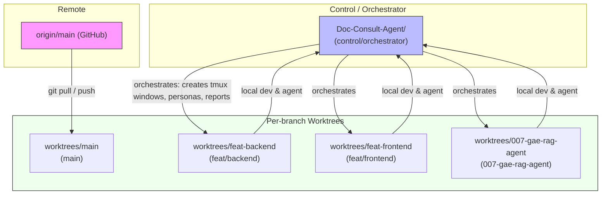
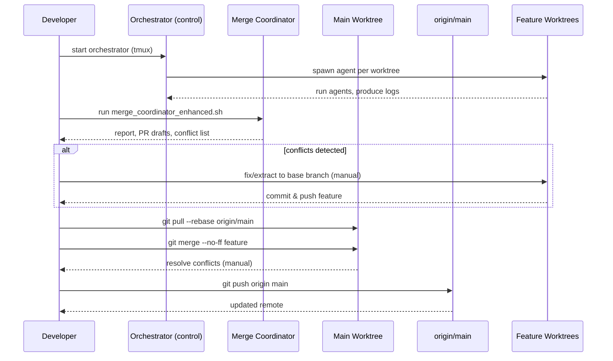

# Doc-Consult-Agent — Workflow (locked)

> Canonical, authoritative workflow for the Doc-Consult-Agent multi-worktree
>
> * Gemini-agent orchestration environment.

This document is the single source of truth for developers and operators. It
contains the safe manual workflow, the operational scripts to use, and the
rules that protect branch ownership and agent behavior.

---

## 1. Overview

* **Control worktree (orchestrator)**: `/home/tcyber/Projects/Doc-Consult-Agent` — branch `control/orchestrator` (runs scripts, owns `AGENTS.md`).
* **Feature worktrees**: sibling directory `../worktrees/<branch-safe>/` — one worktree per branch; each runs a Gemini agent in its own tmux window.
* **Main worktree**: `../worktrees/main` — integration preview only; read-only for development and used as the merge cockpit.
* **Infra** (optional): `infra/` — centralized Docker compose and runtime artifacts (run Docker here, not in worktrees).
* **Logs and drafts**: `../worktrees/logs/` and `../worktrees/pr-drafts/`.

Core principle: **Read-only automation, human-in-the-loop merges.** Scripts provide visibility and suggestions only; **all Git state changes (rebase/merge/push)** are performed manually by humans.

---

## 2. Scripts & Responsibilities

* `scripts/gemini_orchestrator.sh` — create worktrees, ensure excludes, spawn tmux session (`gemini-agents`), one window per worktree, `meta-orchestrator` and `merge-coordinator` windows. Commands: `start | stop | status | attach | cleanup`.
* `scripts/run_gemini_agent.sh` — run `gemini` interactively in a worktree and log to `../worktrees/logs/<branch>.log`.
* `scripts/merge_coordinator_enhanced.sh` — read-only summarizer: detects overlapping files, extracts truncated diffs, calls Gemini (optional) and writes a timestamped report and per-branch PR drafts.
* `scripts/ensure_git_exclude.sh` — safely updates `.git/info/exclude` to ignore runtime artifacts while keeping `.gemini/skills` tracked.
* `scripts/ephemeral_agent.sh` (optional) — create ephemeral worktrees and tmux windows for temporary parallel agents.
* `scripts/headless_task_worker.sh` — file-queue headless worker for scheduled tasks.
* `scripts/ci_push_agent.sh` — helper to push & open PRs after manual review (must be invoked by a human).

---

## 3. Rules & Roles (must follow)

1. **One branch = one worktree** for concurrent agents. Do not run multiple branches in the same long-lived worktree concurrently.
2. **Control worktree** edits `scripts/` and `AGENTS.md` only. Rebase this branch onto `main` regularly. Do not develop product features here.
3. **Feature worktrees**: do product development, commit, test, push, and open PRs. They may read `AGENTS.md` but must not modify it.
4. **Main worktree** is the merge cockpit: perform final merges here; do not commit or push from `main` directly (prefer PR merges via review).
5. **No feature↔feature merges** except via a short-lived `base` branch extracted only when absolutely necessary.
6. **All automation is read-only**: merge coordinator, orchestrator, and agents provide recommendations only. Humans perform rebase/merge/push.

---

## 4. Day-to-day Command Cheatsheet

### Start orchestrator and attach

```bash
cd /home/tcyber/Projects/Doc-Consult-Agent
./scripts/ensure_git_exclude.sh
./scripts/gemini_orchestrator.sh start
tmux attach -t gemini-agents
```

### Work in a feature worktree

```bash
cd /home/tcyber/Projects/worktrees/feat-backend
# edit, test
git add .
git commit -m "feat: ..."
git push origin feat/backend
```

### Rebase feature on main (recommended before final PR)

```bash
cd /home/tcyber/Projects/worktrees/feat-backend
git fetch origin
git rebase origin/main
# resolve conflicts if any, then
git push --force-with-lease origin feat/backend
```

### Merge from the main worktree (merge cockpit)

```bash
cd /home/tcyber/Projects/worktrees/main
git fetch origin
git checkout main
git pull origin main
git merge --no-ff feat/backend -m "Merge feat/backend"
# test, then
git push origin main
```

### Run merge coordinator (pre-merge checks)

```bash
cd /home/tcyber/Projects/Doc-Consult-Agent
./scripts/merge_coordinator_enhanced.sh
less ../worktrees/logs/merge-coordinator-<ts>.log
less ../worktrees/pr-drafts/<branch>-draft-<ts>.md
```

---

## 5. Git hygiene & excludes

* Keep `.gemini/skills/` tracked. Exclude only volatile `.gemini/*` subpaths (cache, sessions, logs) via `scripts/ensure_git_exclude.sh` which writes to `.git/info/exclude`.
* Install `pre-push` hook on developer machines to block pushes from `main` if desired.
* Keep `PRESERVE_WORKTREES=true` default in orchestrator to avoid accidental deletions.

---

## 6. Merge conflict policy

* Always run `merge_coordinator_enhanced.sh` before merging multiple branches.
* If overlapping files are flagged, prefer to extract shared code into a `base` branch, merge base → main, then rebase features onto main.
* Manual conflict resolution required: a human must resolve conflicts in the appropriate worktree and then re-run coordinator to confirm.

---

## 7. Safety & CI suggestions

* Keep `merge_coordinator_enhanced.sh` in CI as a dry-run check called on a PR review job (producing a report artifact).
* Add a `--json` output mode for programmatic CI parsing (optional future enhancement).
* Do not permit automatic rebase/merge in CI. CI can propose merges but must never modify branches.

---

## 8. Recovery recipes

* Recreate deleted worktree:

```bash
git -C /home/tcyber/Projects/Doc-Consult-Agent fetch origin feat/backend:feat/backend || true
git -C /home/tcyber/Projects/Doc-Consult-Agent worktree add ../worktrees/feat-backend feat/backend
git -C /home/tcyber/Projects/Doc-Consult-Agent worktree prune
```

* Recover from tmux issues:

```bash
tmux kill-server
./scripts/gemini_orchestrator.sh start
```

---

## 9. How to propose changes to this workflow

1. Edit `WORKFLOW.md` only in the `control/orchestrator` worktree.
2. Open a PR from `control/orchestrator` to `main` describing the change and rationale.
3. Merge after human review. Do not let agents auto-approve this governance file.

---

## 10. Appendix: quick references

* Orchestrator session: `tmux attach -t gemini-agents`
* List worktrees: `git worktree list`
* Check agent logs: `ls ../worktrees/logs`
* PR drafts: `ls ../worktrees/pr-drafts`

---

*End of WORKFLOW.md — maintained by control/orchestrator.*

## Diagrams (Mermaid)

Below are two Mermaid diagrams that visualize the workflow. Paste these code blocks directly into this `WORKFLOW.md` file (they are already embedded here) — GitHub renders Mermaid diagrams in Markdown.

### High-level flow (Mermaid flowchart)



### Step-by-step merge lifecycle (Mermaid sequence diagram)



### Where to put this

Place `WORKFLOW.md` at the repository root (the control/orchestrator worktree):

```
/home/tcyber/Projects/Doc-Consult-Agent/WORKFLOW.md
```

That location ensures the canonical workflow and diagrams are visible to all contributors and render correctly on GitHub. Commit the file on the `control/orchestrator` branch and open a PR to `main` if you want to publish this as the authoritative workflow.

### Commit steps (recommended)

```bash
cd /home/tcyber/Projects/Doc-Consult-Agent
git checkout control/orchestrator
git add WORKFLOW.md
git commit -m "docs: update WORKFLOW.md with Mermaid diagrams"
git push origin control/orchestrator
# open PR to main via gh or GitHub UI
```

### View notes

* GitHub renders Mermaid diagrams in Markdown files in the repository and PRs. If your org's settings block rendering you can preview locally using a Markdown viewer (VS Code + Mermaid plugin) or at [https://mermaid.live/](https://mermaid.live/) by pasting the code blocks.

---

*End of embedded diagrams.*
